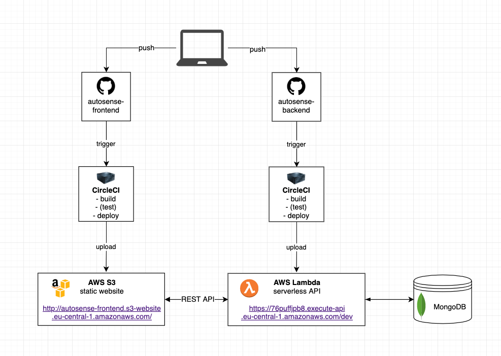
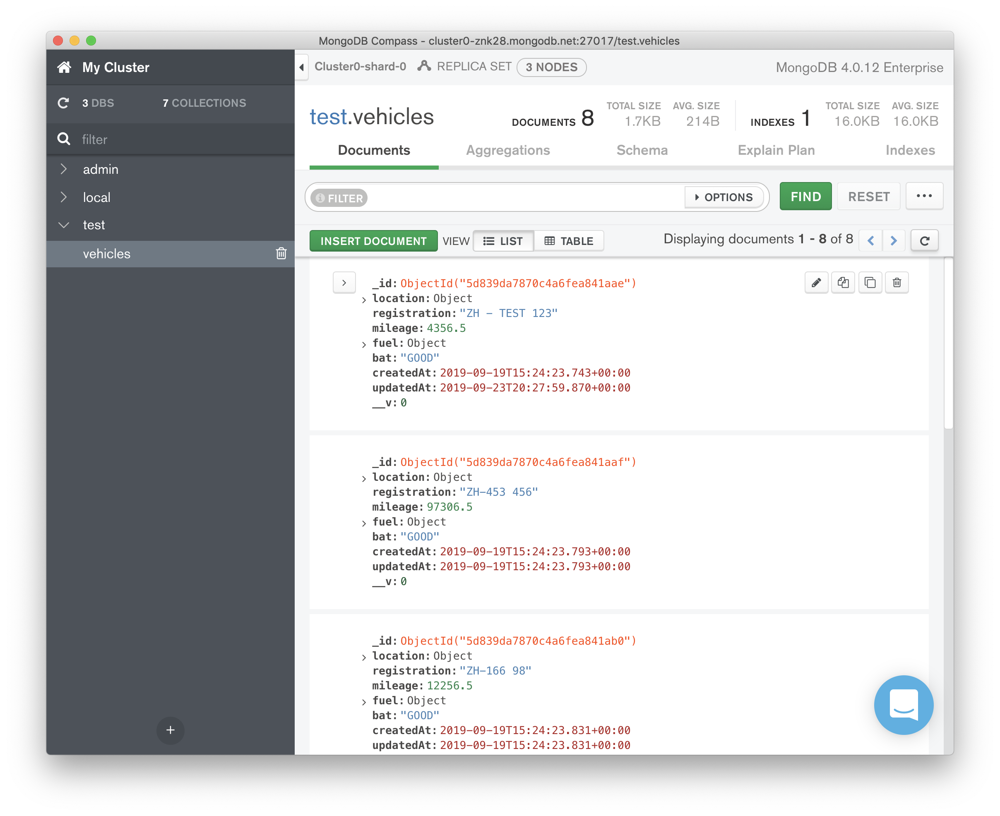

# Serverless Backend for the Autosense Exercise App

[](https://circleci.com/gh/edipetres/autosense-backend)

## Setup

- Install Node 8.10 (latest runtime supported by AWS Lambda)

- Install serverless

```bash
npm i -g serverless
```

- Install node modules 

```
npm install
```

- Initialize env variables 
```
touch .env
```

- Add the Mongo connection string under `MONGO_URL` in your `.env` file. This is intentionally not included in the project. That is, in a real world scenario we would not expose our database credentials.

- Run tests 
```bash
npm test
```

## Running locally

- Start serverless offline

```sh
$ npm start
```

- Send a HTTP `GET` request to `localhost:3000/vehicles`

## Rest API

The REST API is currently deployed to
`https://76puffjpb8.execute-api.eu-central-1.amazonaws.com/dev`

Find the documentation [here](docs/rest-api.md).

## Architecture diagram of the Systems


## Deployment with CI/CD

Our application is hosted on Github where each commit will trigger our Continuous Integartion pipeline. The CI pipeline builds the code, runs the tests and deployes to production when all the checks have passed. This way we ensure there is continous integartion and deployment of the latest version.

## Hosting

We use the *Serverless* framework to abstract away the deployment to our prefered Cloud Service Provider. In our case we use AWS Lambda. CircleCI is given access to automatically deploy new versions of the application to our Lambda service environment.

## Monitoring

The application continuously pushes logs to Amazon CloudWatch that can be used for live monitoring. For more advanced monitoring capabilites we can use Dashbird.io that integrates with AWS to show us advanced insights of the system.

## Database

We use a managed NoSQL Mongo database running on MongoDB Atlas. It is a free sandbox version that offers 500 MB of storage for free. It was populated with the given JSON data by running the following command: `node src/app/helpers/import.js`

The data model for the **vehicle** entity is defined in [src/app/vehicles/model.js](src/app/vehicles/model.js)



## Architecture

The object entities (such as `vehicle`) are grouped into their own folders in `src/app`. There, you can see four different handlers for each entity: `controller, model, repository and router`. 

**Model** is responsible for defining the entity (object) model and it also servers as the mongoose schema for validating fields of the object (for example before inserting data into the database). 

**Repository** takes care of every interaction with the database - we can call it the presistence layer. It knows of the model and only this file can use the mongoose model to interact with the database.  

**Controller** will handle incoming HTTP requests and uses the repository for getting data in and out of the system. 

**Router** defines all the routes and methods for a specific entity and delegates these endpoints for certain methods of the controller.

The above architecture provides a clean and organized setup. It also allows easy extension of the system for both horizontal sclaing (adding more entities/endpoints) and vertical scaling (adding more functionality to existing endpoints). Using this setup we adhere to good coding practices, like separation of concerns, single responsibility, DRY code that can also make testing easier.

## Pre-configuration

I corrected a few typos in the JSON data. It did not change the format or the values of the content, only renamed the following variables: `latittude -> latitude, mlieage -> mileage and litters -> liters`.
